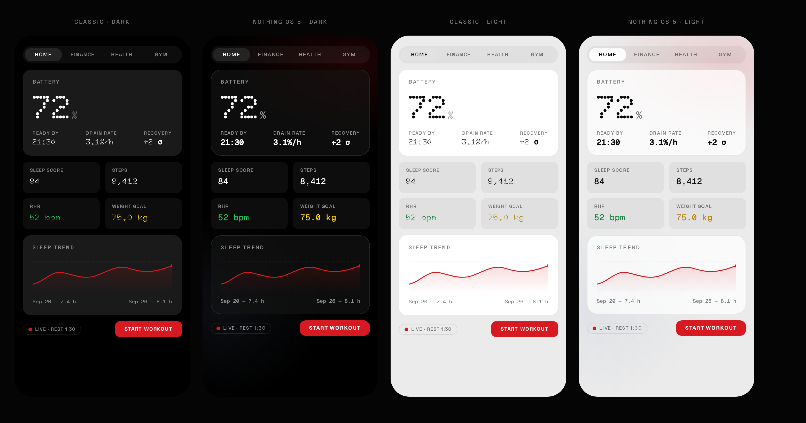
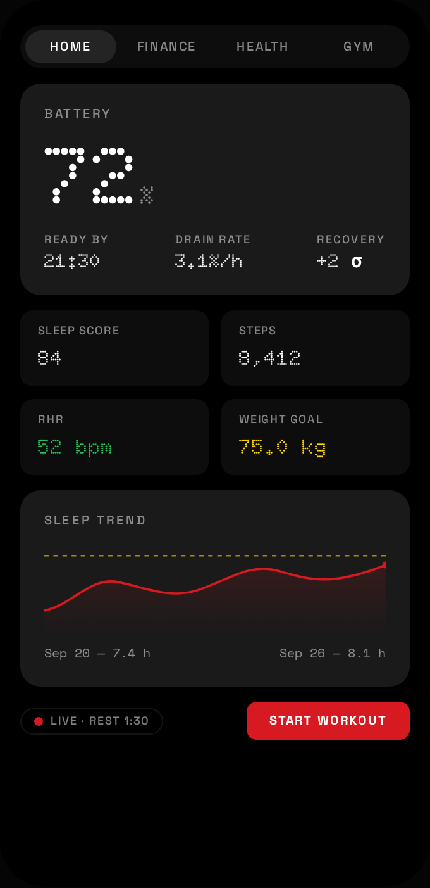
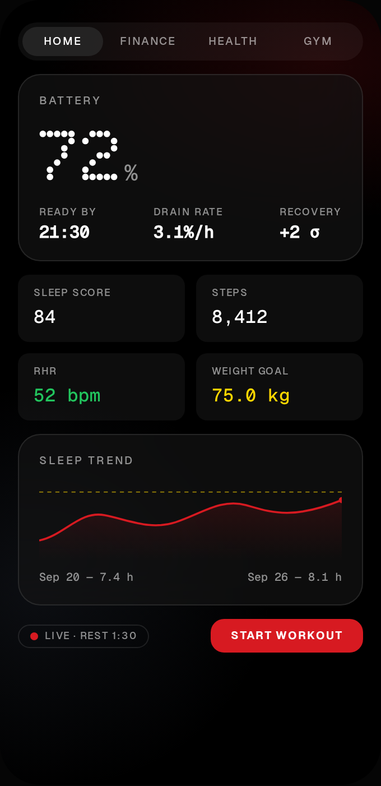

# dashbord Design System — Nothing OS & Nothing OS 5

**Status: authoritative reference.** Two style skins live side by side, exactly
as Nothing itself ships Nothing OS 5.0 (announced 2026-08-25: the OS 5 look is
*an additional theme alongside the classic style*, not a replacement).

- Artwork: [`design/theme-comparison.png`](design/theme-comparison.png) (all four variants)
- Interactive mockup: [`design/theme-mockup.html`](design/theme-mockup.html) (open in a browser; tokens mirror `src/theme/variables.css`)
- Per-variant stills: `design/variant-{classic,os5}-{dark,light}.png`



---

## 0. Core vision (unchanged by the OS 5 skin)

A hyper-minimalist, technical command center: raw data, structural honesty,
technical essentialism over decorative UI — an interface that feels like it's
running directly on the hardware.

- **Technical minimalism** — every element serves a functional purpose; no
  photographic or illustrative assets, the UI is built from typography and
  geometry.
- **The monochrome palette** — deep blacks as the void-like canvas, white/gray
  hierarchy, and ONE red "pulse" used exclusively for status: live/recording,
  warnings, active states.
- **Hardware-inspired visualization** — dotted rings, dot-matrix numerals,
  LED-like readouts; charts as technical instruments, not decorations.
- **Tactile interaction** — fast, purposeful motion, press-scale feedback,
  no fluff.
- **Four pillars** — Home (system overview), Health (biometric calibration),
  Finance (asset node management), Gym (physical optimization).

Nothing OS 5's update to that vision: **dot-matrix becomes character, not the
workhorse.** Readability takes priority; depth comes from a frosted
translucent material instead of flat fills; corners round out. The monochrome
guardrail stays.

---

## 1. The two styles at a glance

| | **Classic (Nothing OS ≤4)** | **Nothing OS 5** |
|---|---|---|
| Body / headings | Space Grotesk | **Geist** |
| Numerics (tiles, readouts, timers) | Doto (dot-matrix) | **Geist Mono** |
| Hero display numeral | Doto | **Doto — kept as accent** (`--nt-font-accent-display`) |
| Card material | Flat solid surface (`#1A1A1A`) | **Frosted translucent** (blur 24px + saturate 1.4, hairline border) |
| Corner radii | 8 / 16 / 24 px | **12 / 20 / 28 px** |
| Dot-grid texture | Visible pattern | Nearly invisible depth cue |
| Red accent | `#D71A21` — unchanged | `#D71A21` — unchanged |
| Data colors (goal gold, positive green) | unchanged | unchanged |
| Motion tokens | unchanged | unchanged |

 

**The philosophy shift (from Nothing's own OS 5 materials):** dot-matrix is
demoted from *the numeric workhorse* to *character accent* — "character rather
than compromise readability." Depth comes from a frosted translucent material
instead of flat fills, so hierarchy is carried by layering. The guardrail
Nothing states and we keep: **the system stays predominantly monochrome**;
wallpaper-adaptive colour is deliberately NOT ported (no wallpaper source
inside the app; revisit only if a photo/blur backdrop ever lands).

## 2. How the skin works (architecture)

Both styles are **pure token swaps** — no page knows which skin is active.

```
<html class="theme-light? theme-os5?">
  :root                    → classic dark tokens (defaults)
  html.theme-light         → light surfaces/ink (existing)
  html.theme-os5           → OS 5 fonts/radii/material (dark)
  html.theme-os5.theme-light → OS 5 light surfaces
```

- State: `useTheme.ts` — two orthogonal axes
  - `mode`: `dark | light | system` (persisted `app_theme`), unchanged
  - `style`: `classic | os5` (persisted `app_theme_style`), toggles `theme-os5`
- OS 5 frost applies to `ion-card` / `.card` globally via
  `backdrop-filter: var(--nt-frost)`. Floating overlays (alerts, action
  sheets, popovers) use the SOLID `--nt-surface-fallback` — blur over the
  dimmed backdrop reads as mud, and text contrast must be guaranteed.
- `@supports not (backdrop-filter…)` → solid fallback. (Capacitor WebView =
  Chromium 130+, always supported; the guard is belt-and-braces.)
- Charts: `chartStyle.ts` ink getters resolve from the html classes — the ink
  triplet is identical in both styles, so charts need no per-style config.
  Canvas font inherits `--ion-font-family`, which flips to Geist in OS 5.

### Token reference (OS 5 deltas only — everything else inherits)

| Token | Classic (dark) | OS 5 (dark) | OS 5 (light) |
|---|---|---|---|
| `--nt-font-body` / `--nt-font-head` | Space Grotesk | Geist | Geist |
| `--nt-font-display` (numerics) | Doto | Geist Mono | Geist Mono |
| `--nt-font-accent-display` | Doto | Doto (hero only) | Doto (hero only) |
| `--nt-font-mono` | Space Mono | Geist Mono | Geist Mono |
| `--nt-radius-sm/md/lg` | 8/16/24 | 12/20/28 | 12/20/28 |
| `--nt-surface` | `#1A1A1A` solid | `rgba(20,20,20,.66)` + frost | `rgba(255,255,255,.72)` + frost |
| `--nt-surface-fallback` | — | `#141414` | `#FFFFFF` |
| `--nt-frost` | — | `blur(24px) saturate(1.4)` | same |
| `--nt-border` | ink 8% | white 10% | black 8% |

**Font licensing:** all faces are SIL OFL 1.1, self-hosted. Geist via
`@fontsource/geist-sans` + `@fontsource/geist-mono` (web) and the same TTFs
decompressed into `android/app/src/main/res/font/geist*.ttf` (native widgets).
Nothing's own NDot/NType are never shipped.

## 3. Rules that hold in BOTH styles

1. **One red accent** (`--nt-accent`) used as signal only: live/recording,
   destructive, active. Never decoration.
2. **Data colors never paint chrome**: gold = goal encoding, green = positive.
   Identical in both skins.
3. **Doto is never body text**; in OS 5 it is additionally *never* a metric
   tile or readout — hero display numerals only.
4. Cards are borderless in Classic; in OS 5 they carry exactly one hairline
   (`--nt-border`) as the frost edge — not a second accent.
5. `--ion-text-color` must stay defined in every theme block (the
   black-on-grey regression lives in this token).
6. Spacing, motion, and the max-content-width (760px) scales are shared.

## 4. Theme switcher (Settings → Preferences)

- **Theme:** System / Light / Dark (existing axis)
- **Style:** Nothing OS / Nothing OS 5 (new segment control beneath it)

Switching style immediately:
1. re-points every `--nt-*` token (class toggle),
2. pushes `{ themeStyle }` into the native widget snapshot → widgets
   re-render in the new skin within one broadcast.

## 5. Native widgets (Android)

Data flow unchanged (JS snapshot → `WidgetData` prefs → providers). New:
every pushed snapshot carries an explicit `themeStyle` (`classic`|`os5`);
`WidgetTheme.isOs5(json)` resolves it per render, defaulting to classic on
any missing/garbage value (an old snapshot can never half-theme a widget).

Per provider, two static layouts — picked at inflate time:

| Widget | classic layout | os5 layout | OS 5 deltas |
|---|---|---|---|
| Sleep score | `widget_sleep.xml` | `widget_sleep_os5.xml` | Geist Mono 600 score, Geist labels, panel radius 28 |
| Sleep battery | `widget_sleep_battery.xml` | `widget_sleep_battery_os5.xml` | Geist Mono `%`, ring track lighter (`WidgetTheme.trackColor`) |
| Sleep stages | `widget_sleep_stages.xml` | `widget_sleep_stages_os5.xml` | Geist Mono numerals; timeline stage colors unchanged (data) |
| Briefing | `widget_briefing.xml` | `widget_briefing_os5.xml` | Geist throughout; VU bar unchanged (data) |

- OS 5 panel drawable: `drawable/widget_bg_os5.xml` — `#D9141414`, 28dp
  radius, `#1FFFFFFF` hairline. (True frost isn't possible in RemoteViews;
  translucency + hairline is the honest approximation.)
- Fonts: `res/font/geist.xml` + `res/font/geist_mono.xml` font families.
- **RemoteViews allow-list rule still absolute**: TextView/LinearLayout/
  FrameLayout/ImageView only. Gate before any widget release:
  `grep -n '<View\|<Space' android/app/src/main/res/layout/widget_*.xml`
  must return nothing (mind XML comments containing those strings).

## 6. Extending

- **New token?** Add to `:root` (classic default) and re-point in
  `html.theme-os5` / `html.theme-os5.theme-light` if the OS 5 value differs.
  Never hard-code a skin value in a component.
- **New widget?** Classic + OS5 layout pair, same view IDs, register both in
  the provider's layout pick, keep the allow-list rule.
- **New page?** Use tokens + shared primitives (`.nt-kicker`, `.nt-metric-tile`,
  `NtCard`/`NtMetric`/`TrendChart`) — it is then automatically dual-skinned.
- **Wallpaper-adaptive colour (deferred):** would need a backdrop image source
  inside the app. If ever built: sample 2–3 hues, tint ONLY chips/segment
  fills, keep text/surfaces monochrome — Nothing's own guardrail.
